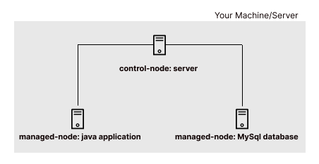

# Objetivo
O objetivo deste projeto foi **automatizar a configuração de dois nós gerenciados (managed nodes) utilizando Ansible**. Um dos nós deveria ser configurado como um **servidor MySQL**, enquanto o outro deveria hospedar uma **aplicação Java**.

# Desafios e Soluções
### Qual o problema?
- Provisionamento de Máquinas Virtuais Manualmente
- Configuração do MySQL Manual
- Deploy da Aplicação Java Manualmente

### Seu trabalho para resolver?
- Desenvolvimento de scripts ou playbooks Ansible para provisionar máquinas virtuais
- Desenvolvimento de um playbook Ansible para configurar o servidor MySQL, incluindo a instalação do MySQL, criação de usuários e configurações de segurança.
- Desenvolvimento de um playbook Ansible para copiar os artefatos da aplicação Java para o nó gerenciado apropriado, além de garantir que o serviço Java esteja em execução.

### Qual foi o resultado?
- Máquinas virtuais foram criadas com sucesso, proporcionando ambientes isolados para o MySQL e a aplicação Java.
- A configuração dinâmica permitiu uma conexão bem-sucedida entre a aplicação Java e o servidor MySQL, proporcionando funcionalidade completa.

# Etapas
Antes de você realizar o push deste repositório e testar, algumas etapas precisam ser realizadas:

1. Suba o control-node e os managed-hosts sem os arquivos de provision (Apenas comente)
2. Acesse o control-node via ssh e gere uma chave pública (ssh-keygen)
3. Adicione essa chave pública no arquivo de provisionamento de cada managed-host e rode o comando: ``vagrant reload --provision``. Teste a conexão com: ``ansible -m ping all`` ou faça um ping no IP.
4. Instale o MySQL do Ansible Galaxy em seu control-node usando o comando: ``ansible-galaxy install geerlingguy.mysql``
5. Após as alterações acima, vamos subir os nossos serviços. No control-node, navegue até o diretório dos playbooks ``cd /vagrant/playbooks/`` e rode os seguintes comandos:
    - Para subir o MySQL via YAML: ``ansible-playbook db.yaml``
    - Para subir a aplicação via YAML: ``ansible-playbook app.yaml``
6. Para testar a API, altere o arquivo ``note.json`` com os valores que deseja inserir e realize seguinte requisição via API: ``curl -H "Content-Type: application.json" --data @note.json http://app01:8080/api/notes``

# Ferramentas / Tecnologia
- Ansible
- Vagrant
- Linux
- VirtualBox

# Arquitetura

---
---
---

# Objective
The objective of this project was to **automate the configuration of two managed nodes using Ansible**. One of the nodes should be configured as a **MySQL server**, while the other should host a **Java application**.

# Challenges and Solutions
### What was the problem?
- Provisioning Virtual Machines Manually
- Manual MySQL Configuration
- Deployment of the Java Application Manually

### Your job to solve?
- Development of Ansible scripts or playbooks to provision virtual machines
- Development of an Ansible playbook to configure the MySQL server, including MySQL installation, user creation and security configurations.
- Development of an Ansible playbook to copy Java application artifacts to the appropriate managed node and ensure the Java service is running.

### What was the result?
- Virtual machines were successfully created, providing isolated environments for MySQL and the Java application.
- Dynamic configuration enabled a successful connection between the Java application and the MySQL server, providing full functionality.

# Topics
Before pushing this repository and testing, several steps need to be completed:

1. Start the control-node and managed-hosts without the provisioning files (just comment them).
2. Access the control-node via SSH and generate a public key (ssh-keygen).
3. Add this public key to the provisioning file of each managed-host and run the command: ``vagrant reload --provision`` Test the connection with: 
``ansible -m ping all`` or just make a ping to the IP.
4. Install MySQL from Ansible Galaxy on your control-node using the command:``ansible-galaxy install geerlingguy.mysql``
5. After the above changes, let's start our services. On the control-node, navigate to the playbook directory ``cd /vagrant/playbooks/`` and run the following commands:
    - To start MySQL via YAML: ``ansible-playbook db.yaml``
    - To start the application via YAML: ``ansible-playbook app.yaml``
6. To test the API, modify the ``note.json`` file with the values you want to insert and make the following API request: ``curl -H "Content-Type: application.json" --data @note.json http://app01:8080/api/notes``

# Tools
- Ansible
- Vagrant
- Linux
- VirtualBox

# Architecture
